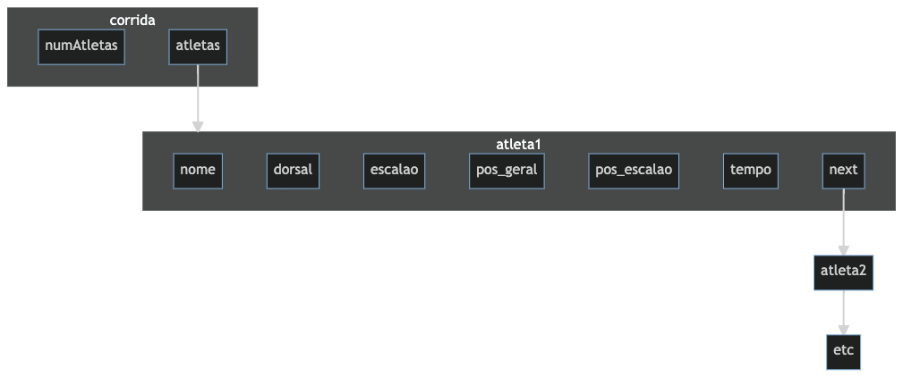

# Corrida ATEC


## Enquadramento
A ATEC realiza anualmente uma corrida de solidariedade. Por forma a informatizar as consultas de resultados, a ATEC solicitou à turma a realização de um pequeno programa que carregue os resultados gerais e permita a consulta, através do número de dorsal, das informações de corrida de cada atleta que terminou a prova

ATEC organizes a charity race every year. In order to computerize the consultation of results, ATEC asked the class to make a small program that loads the general results and allows the consultation, through the dorsal number, of the race information of each athlete that finished the race

## Fciheiro de Resultados Gerais
Considere um ficheiro de dados de texto que contém os resultados de uma prova de atletismo. Cada linha do ficheiro 
representa um participante e contém a seguinte informação:
- Posição: Posição geral em que acabou a prova. Exemplo de ficheiro no servidor GIT
- Escalão: Caracter seguido de um número. O caracter pode ser M (masculino) ou F (feminino) e o número 
corresponde à idade mínima do escalão.
- Dorsal: Número do dorsal. Atribuído durante a inscrição
- Nome: Nome do participante.
- Sexo: M (masculino) ou F (feminino)
- Tempo: Tempo que demorou a completar a prova.

Cada atleta é uma linha do ficheiro e os campos do ficheiro encontram-se delimitados por um tab (\t).

Exemplo linhas de um ficheiro (Repare que a primeira linha do ficheiro não deve ser carregada para o programa):
```txt
Pos.	Escalão	Pos. Esc.	Dorsal	Nome	Sexo	Tempo
1	M35	1	6	Jose Moreira	M	1:07:49 AM
2	M35	2	8	Rui Pedro Silva	M	1:08:32 AM
3	M35	3	7	Nicodemus Biwott	M	1:08:44 AM
4	M20	1	696	Bruno Miguel Ramos Da Silva	M	1:08:48 AM
5	M20	2	14	Rui Muga	M	1:08:54 AM
6	M20	3	13	Mihail Lalev	M	1:08:55 AM
7	M20	4	672	João Antunes	M	1:11:42 AM
8	M20	5	5	Paulo Mendes	M	1:11:57 AM
9	M35	4	11	Oscar Mendes	M	1:13:02 AM
10	M20	6	900	Bruno Carvalho	M	1:13:13 AM
...
...
```

## General Results File
Consider a text data file that contains the results of a track and field race. Each line of the file 
represents one participant and contains the following information:
- Position: overall position in which he finished the race. Example of file on GIT server
- Rank: Character followed by a number. The character can be M (male) or F (female) and the number 
corresponds to the minimum age in the class.
- Dorsal: Dorsal number. Allocated during registration
- Name: Name of the participant.
- Sex: M (male) or F (female)
- Time: Time that took to complete the race.

Each athlete is a line in the file and the fields in the file are delimited by a tab (æt).

Example lines from a file (Notice that the first line of the file should not be loaded into the program):
```txt
Pos.	Rank Pos. Rank Pos. Name Gender Time
1	M35	1	6	Jose Moreira	M	1:07:49 AM
2	M35	2	8	Rui Pedro Silva	M	1:08:32 AM
3	M35	3	7	Nicodemus Biwott	M	1:08:44 AM
4	M20	1	696	Bruno Miguel Ramos Da Silva	M	1:08:48 AM
5	M20	2	14	Rui Muga	M	1:08:54 AM
6	M20	3	13	Mihail Lalev	M	1:08:55 AM
7	M20	4	672	João Antunes	M	1:11:42 AM
8	M20	5	5	Paulo Mendes	M	1:11:57 AM
9	M35	4	11	Oscar Mendes	M	1:13:02 AM
10	M20	6	900	Bruno Carvalho	M	1:13:13 AM
...
...
```

## Trabalho a efetuar
### Ler Ficheiro e criar lista encadeada de atletas | Read file and create chained list of athletes
- O nome do ficheiro deve ser passado ao programa por um argumento de linha de comando: `./corrida results-atec.txt`
  - Caso o ficheiro não exista (erro ao abrir em modo de leitura), o programa deve terminar com a seguinte mensagem de erro `ERRO! Ficheiro não encontrado`;
- Crie estrutura(s) que permitam guardar a informação e gerar uma lista encadeada (simplesmente encadeada ou duplamente encadeada é uma opção sua);
- Utilize alocação dinâmica de memória para inserir na Lista cada uma das linhas,ou seja cada um dos atletas;
- Todo o ficheiro deve ser carregado numa lista encadeada;


- The file name must be passed to the program as a command line argument: './running results-atec.txt'. - If the file does not exist (error when opening in read mode), the program should abort with the following error message: 'ERROR! File not found';
- Create one or more structures that will allow you to store the information and create a linked list (single or double linked according to your choice);
- Use dynamic memory allocation to add each line, i.e. each athlete, to the list;
- The entire file must be loaded into a linked list;

### Comportamento esperado do programa | Expected behavior
- O Programa ao iniciar, e caso não haja erro na abertura do ficheiro e criação da lista deve apresentar a mensagem `Insira Nº dorsal->`;
- O utilizador deve inserir o número do dorsal e uma das mensagens deve ser mostrada:
  - **Caso o número inserido seja negativo (<0):** `ERRO! Número de dorsal inválido`
  - **Caso o número inserido seja 0:** `A sair...`
  - **Caso o número inserido seja >0 mas atleta não exista:** `ERRO! Atleta não existe`
  - **Caso o número inserido seja >0 e atleta exista:** Escreve a informação do atleta conforme o exemplo de funcionamento apresentado abaixo:
- O programa só termina a sua execução quando o utilizador inserir `0`;
- A memória alocada dinâmicamente deve ser libertada antes de sair. 


- When the program starts and no error occurs when opening the file and creating the list, the message 'Enter return number - >' should be displayed;
- The user must enter the return number and one of the following messages should be displayed: 
- **If the number entered is negative (>0):** `ERRO! Invalid back number`
- **If the entered number is 0:** `EXIT...` 
- **If the entered number is > 0, but the athlete does not exist:** `ERRO! Athlete does not exist`
- **If the entered number > is 0 and the athlete exists:** Write the athlete's data according to the example below:
- The program will not finish its execution until the user enters `0`;
- The dynamically allocated memory must be freed before exiting.

Exemplos de funcionamento do programa quando não foi passado o ficheiro ou este não exista:
```console
ERRO! Ficheiro não encontrado
A sair ...
```
Examples of how the program works when the file is not loaded or does not exist:
'''console
ERROR! File not found
Exit ...
'''
Exemplos de funcionamento do programa quando o ficheiro é carregado com sucesso
```console
Insira Nº dorsal->777
ERRO! Atleta não existe
Insira Nº dorsal->-3
ERRO! Número de dorsal inválido
Insira Nº dorsal->900
---------------------
Atleta: Bruno Carvalho
Sexo: M
Escalão: M20
Pos. Geral: 10
Pos. Escalão: 6
Tempo Prova: 1:13:13
--------------------
Insira Nº dorsal->0
A sair ...

```

Examples of how the program works when the file is successfully loaded
```console
Input # dorsal-> 777
ERROR! Athlete does not exist
Insert number of dorsal->-3
ERROR! Invalid back number
Insert number of dorsal-> 900
---------------------
Athlete: Bruno Carvalho
Gender: M
Age group: M20
Place. Overall: 10
Pos. Age Group: 6
Time trial: 1:13:13
--------------------
Insert Dorsal Number-> 0
Coming out ...

```
### Sugestões | Recommendations 

- Teste o programa com o valgrind, para aferir a correta manipulação de memória. Programas sem erros na manipulação de memória são valorizados
- Considere, na leitura das linhas do ficheiro que a dimensão maxima da linha é 1024 caracteres
- Utilize a função strtok para partir a string pelos tabs (\t) por forma a extrair os campos. veja exemplo em [tutorialspoint](https://www.tutorialspoint.com/c_standard_library/c_function_strtok.htm) ou em [geeksforgeeks](https://www.geeksforgeeks.org/strtok-strtok_r-functions-c-examples/) ou em Português no site [Wiki C](http://www.br-c.org/doku.php?id=strtok), ou ainda um video no [Youtube](https://www.youtube.com/watch?v=AvhzhMeKDOU)
- Os campos das estruturas (por exemplo o nome) só devem acupar o espaço estritamente necessário (Necessário fazer malloc)
- Sugere-se a seguinte estrutura na criação das structs
 
- Organize o seu código criando uma biblioteca. por xemplo corrida.h e corrida.c
  - No ficheiro main.c deixe apenas a função main e outras necessárias para ler o ficheiro e analisar os argumentos de linha de comando

- Test the program with valgrind to verify that it manipulates memory manipulation. Programs without errors in memory manipulation are scored
- When reading lines from the file, note that the maximum line size is 1024 characters
- Use the strtok function to break the string by the tabs (\t) to extract the fields. See the example at [tutorialspoint](https://www.tutorialspoint.com/c_standard_library/c_function_strtok.htm) or at [geeksforgeeks](https://www.geeksforgeeks.org/strtok-strtok_r-functions-c-examples/) or in Portuguese on the [Wiki C](http://www.br-c.org/doku.php?id=strtok) page, or even a video at [Youtube](https://www.youtube.com/watch?v=AvhzhMeKDOU)
- Structure fields (e.g. the name) should only take up as much space as absolutely necessary (malloc required)
- The following structure is suggested when creating structures
 Diagram]( mermaid-diagram-corridaATEC.png)
- Organize your code by creating a library, for example corrida.h and corrida.c - In the main.c file, leave only the main function and other functions needed to read the file and parse the command line arguments


